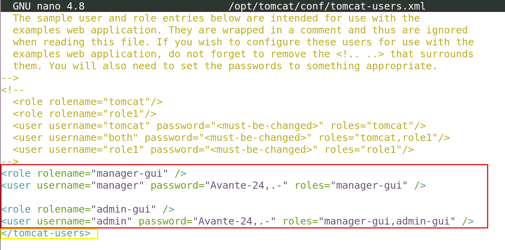
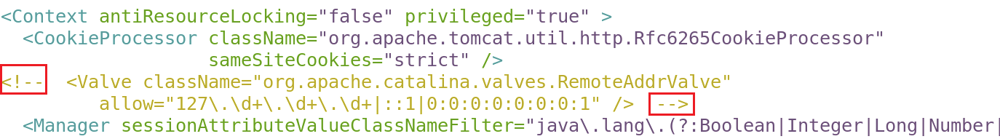
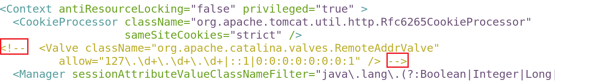
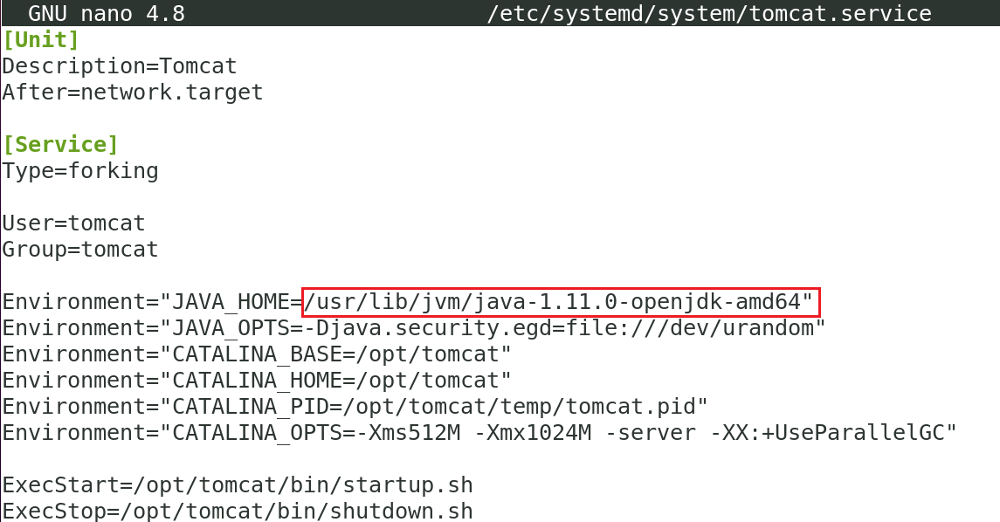
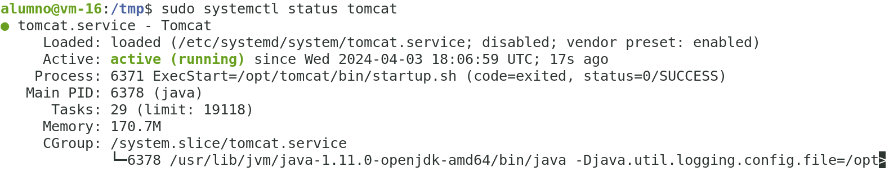
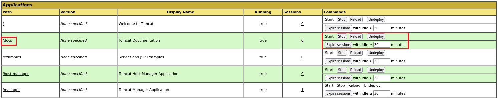
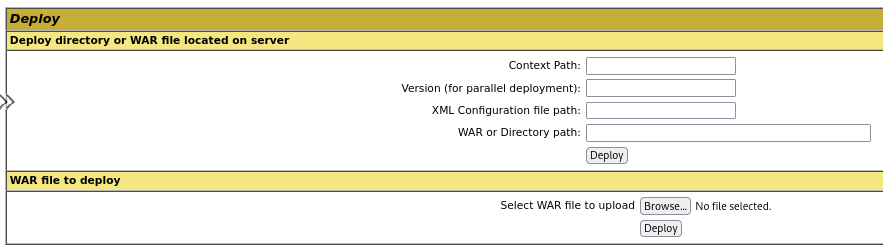

# Instalación de Tomcat.

Es conveniente que desinstalemos de la máquina virtual cualquier otro servidor web que estuviera presente, ya que podría interferir con Tomcat.

Si nginx estuviera instalado, procedemos a su desinstalación.


Para desinstalar Nginx en Ubuntu 20.04, puedes seguir estos pasos:

1. **Detener el servicio de Nginx**: Primero, asegúrate de detener el servicio de Nginx para evitar cualquier interrupción durante el proceso de desinstalación. Puedes detenerlo ejecutando el siguiente comando en tu terminal:

```bash
sudo systemctl stop nginx -y
```

2. **Desinstalar el paquete Nginx**: Una vez que el servicio de Nginx esté detenido, puedes proceder a desinstalar el paquete Nginx. Ejecuta el siguiente comando en la terminal:

```bash
sudo apt-get remove --purge nginx -y
```

Este comando eliminará el paquete Nginx y todos sus archivos de configuración, pero dejará los archivos de datos (como los sitios web) intactos.

3. **Eliminar archivos de configuración residuales**: Si deseas eliminar todos los archivos de configuración residuales de Nginx, puedes ejecutar el siguiente comando:

```bash
sudo apt-get purge nginx-common -y
```

Este comando eliminará cualquier archivo de configuración o datos adicionales relacionados con Nginx.

4. **Limpiar la caché del sistema de paquetes**: Finalmente, puedes limpiar la caché del sistema de paquetes para liberar espacio en disco y eliminar cualquier referencia a Nginx. Ejecuta el siguiente comando:

```bash
sudo apt-get autoremove -y
```

Este comando eliminará cualquier paquete instalado que ya no sea necesario, incluidas las dependencias que se instalaron junto con Nginx.

## Creación de usuario tomcat, instalación de JDK y descarga de Tomcat.

Por razones de seguridad, Tomcat debería ser ejecutado en el contexto de un usuario específico que no tenga privilegios y con el que no podamos iniciar sesión nosotros. Creamos el usuario `tomcat`. Nota: el parámetro `/bin/false` indica a Linux que nadie podrá usar la cuenta `tomcat` para inicar sesión en el sistema.

```bash
sudo useradd -m -d /opt/tomcat -U -s /bin/false tomcat
```

Procedemos a instalar el JDK. El primer lugar actualizamos el repositorio.

```bash
sudo apt update -y
```

Instalamos el JDK.

```bash
sudo apt install default-jdk -y
```

Comprobamos la versión que se ha instalado de JDK de Java.

```bash
java -version
```

Para instalar Tomcat, debemos descargarlo desde su página: https://tomcat.apache.org/download-10.cgi

Cambiamos al directorio `/tmp` para descargarlo y descomprimirlo.

```bash
cd /tmp
```

```bash
wget https://dlcdn.apache.org/tomcat/tomcat-10/v10.1.20/bin/apache-tomcat-10.1.20.tar.gz
```

```bash
sudo tar xzvf apache-tomcat-10*tar.gz -C /opt/tomcat --strip-components=1
```

Asignamos la propiedad de los archivos de Tomcat al usuario `tomcat`

```bash
sudo chown -R tomcat:tomcat /opt/tomcat/
```

Asignamos el permiso de ejecución a todos los archivos de la carpeta `/opt/tomcat/bin`.

```bash
sudo chmod -R u+x /opt/tomcat/bin
```

## Configuración de los usuarios administradores de Tomcat.

Tomcat va a ser gestionado por una página web, como la siguiente:


Concretamente en las páginas `Manager`y `Host Manager` que para poder ser usadas es necesario definir qué usuarios podrán acceder a ellas. Esto se hace en la configuración de Tomcat, concretamente en el archivo `/opt/tomcat/conf/tomcat-users.xml`

Editamos el archivo.

```bash
sudo nano /opt/tomcat/conf/tomcat-users.xml
```

Debemos añadir el siguiente código al final del archivo, justo antes de la etiqueta `</tomcat-users>`.

```xml
<role rolename="manager-gui" />
<user username="manager" password="Avante-24,.-" roles="manager-gui" />

<role rolename="admin-gui" />
<user username="admin" password="Avante-24,.-" roles="manager-gui,admin-gui" />
```

Observa, debe quedar en la siguiente posición. En color ***rojo*** destacamos el contenido a pegar, y en color ***amarillo*** señalizamos la etiqueta.



Hemos actualizado la contraseña a `Avante-24,.-`. 

Como podemos ver, el código insertado crea los usuarios `manager` y `admin`, asignando a cada uno respectivamente los roles `manager-gui` y `admin-gui`, que permiten el acceso a las páginas de de administración `Manager` y `Host Manager`.

Guardamos el archivo y salimos.

Es importante saber que, por defecto, Tomcat está configurado para ***restringir el acceso a las páginas de administración***, a menos que la conexión provenga del propio servidor. Para acceder a esas páginas con los usuarios que acabamos de definir desde otrás máquinas, necesitaremos editar los archivos de configuración de esas páginas.

Para eliminar la restricción de la página `Manager`, editamos su archivo de configuración:

```bash
sudo nano /opt/tomcat/webapps/manager/META-INF/context.xml
```

En Tomcat, las etiquetas `valves` son componentes que se utilizan para interceptar y procesar solicitudes entrantes y salientes en el servidor Tomcat. Estos pueden ser utilizados para realizar acciones específicas, como la autenticación, el registro, la `limitación de acceso`, que es lo que nos interesa.

En particular, `RemoteAddrValve` es una válvula específica que permite restringir el acceso a recursos de Tomcat basándose en la dirección IP remota del cliente. Es decir, solo permite el acceso a los recursos de Tomcat desde direcciones IP específicas.

Como podemos ver, esta equiteta limita el acceso desde la IP de localhost, a través de la expresión regular `allow="127\.\d+\.\d+\.\d+|::1|0:0:0:0:0:0:0:1"`.

Para que podamos conectar desde cualquier IP, necesitamos que esta etiqueta no se procese. La forma más sencilla es comentarla en xml, como podemos ver en la siguiente imagen (indicado por los rectángulos en color rojo).



Asegúrate que el archivo queda así y guárdalo.


Ahora debemos hacer lo mismo para el Host Manager. Editamos el archivo.

```bash
sudo nano /opt/tomcat/webapps/host-manager/META-INF/context.xml
```

Asegúrate de que queda como  la siguiente imagen. Guarda el archivo y cierra el editor.




## Creación de un servicio en systemd.

El servicio systemd que vamos a crear hará que Tomcat se ejecute en segundo plano, que se inicie automáticamente al iniciar el sistema o se reinicie si Tomcat detecta un error o fallo.

Tomcat es una aplicación Java en sí misma, por eso requiere que el runtime de  Java esté presente (JRE), pero eso ya lo hemos conseguido cuando instalamos el JDK. En consecuencia, antes de crear el servicio, necesitamos saber dónde se encuentra Java. 

Para ello ejecutamos el siguiente comando:

```bash
sudo update-java-alternatives -l
```

La salida indica la ruta del JRE de java.


La ruta mostrada vamos a usarla en breve.

El servicio `tomcat`se almacena en `systemd` en un archivo llamado `tomcat.service`, en la carpeta `/etc/systemd/system`. Vamos a crear este archivo.

```bash
sudo nano /etc/systemd/system/tomcat.service
```

Copia y pega en el archivo el siguiente contenido.

```bash
[Unit]
Description=Tomcat
After=network.target

[Service]
Type=forking

User=tomcat
Group=tomcat

Environment="JAVA_HOME=/usr/lib/jvm/java-1.11.0-openjdk-amd64"
Environment="JAVA_OPTS=-Djava.security.egd=file:///dev/urandom"
Environment="CATALINA_BASE=/opt/tomcat"
Environment="CATALINA_HOME=/opt/tomcat"
Environment="CATALINA_PID=/opt/tomcat/temp/tomcat.pid"
Environment="CATALINA_OPTS=-Xms512M -Xmx1024M -server -XX:+UseParallelGC"

ExecStart=/opt/tomcat/bin/startup.sh
ExecStop=/opt/tomcat/bin/shutdown.sh

RestartSec=10
Restart=always

[Install]
WantedBy=multi-user.target
```

Asegúrate que la ruta del JRE de Java conincide con la que localizamos antes.



El contenido del archivo `tomcat.service` define un servicio que ejecutará Tomcat mediante la ejecución de los scripts de inicio y apagado que proporciona. También configura algunas variables de entorno para definir su directorio de inicio (que es `/opt/tomcat`) y limitar la cantidad de memoria que la VM de Java puede asignar (en CATALINA_OPTS). En caso de fallo, el servicio de Tomcat se reiniciará automáticamente.

Cuando hayas terminado, guarda y cierra el archivo.

Recargamos el demonio `systemd` para que reconozca el nuevo servicio.

```bash
sudo systemctl daemon-reload
```

Iniciamos el servicio de Tomcat.

```bash
sudo systemctl start tomcat
```

Comprobamos su estado.

```bash
sudo systemctl status tomcat
```

Si todo ha ido bien, Linux debe indicar que el servicio está activo (running)



Para conseguir que Tomcat inicie su servicio al inicar el sistema operativo, ejecutamos lo siguiente.

```bash
sudo systemctl enable tomcat
```

Con esto hemos aprendido a instalar nuestro servidor Tomcat desde cero.

## Usar la página de administración de Tomcat.

Tomcat levanta un servidor en el puerto `8080` con la web de administración. Para poder conectar con él, debemos abrir el firewall.

```bash
sudo ufw allow 8080
```

Ahora, por medio del navegador, conectamos a la interfaz gráfica de administración.

```url
http://localhost:8080
```

Para acceder al administrador de aplicaciones `Manager app` hacemos clic en el botón correspondiente. Se nos pedirá las crecenciales que configuramos anteriormente.

Como usuario podemos:

```plaintext
admin
```

y por contraseña escribimos:

```plaintext
Avante-24,.-
```

La página de administración de aplicaciones del servidor Tomcat es muy sencilla y amigable. En la sección `applications` podemos ver qué aplicaciones está sirviendo nuestro servidor. En la imagen hemos señalado por medio de rectángulos de color rojo las zonas de interés.



En la columna `path` tenemos la URI asociada a la aplicación, mientras que en la columna `commands` aparecen todas las acciones que el administrador puede hacer sobre la aplicación en cuestión.

Coge el navegador y conecta con la siguiente aplicación.

```url
http://localhost:8080/docs
```

Prueba a usar los botónes de `stop`, `start` y `reload` y observa el comportamiento (debes usar CTRL+F5 para evitar la caché del navegador)

La sección `deploy` permite instalar nuevas aplicaciones en el servidor Tomcat. 



Para ello debemos proporcionar cierta información en el formulario de implementación.

Un archivo `WAR` (Web Application Archive) es un tipo de archivo utilizado en el desarrollo de aplicaciones web Java. Está diseñado para ***empaquetar y distribuir*** una aplicación web Java completa, incluyendo todos los archivos necesarios para su ejecución en un contenedor de servlets como Apache Tomcat.

Un archivo WAR puede contener los siguientes elementos:

1. **Archivos de recursos estáticos**: Estos son archivos como HTML, CSS, JavaScript, imágenes y otros recursos estáticos que son necesarios para la interfaz de usuario de la aplicación web. Estos archivos se encuentran típicamente en el directorio `WEB-INF` dentro del archivo WAR.

2. **Archivos de clases Java**: Los archivos de clases Java compiladas, junto con cualquier otra clase o biblioteca de terceros que la aplicación web pueda necesitar, se encuentran dentro del archivo WAR. Estas clases contienen la lógica de negocio y el comportamiento de la aplicación.

3. **Descriptores de implementación**: Un archivo WAR contiene uno o más descriptores de implementación que proporcionan información sobre cómo se debe implementar y ejecutar la aplicación web en el contenedor de servlets. El archivo `web.xml` es el descriptor de implementación más común para aplicaciones web Java basadas en Servlet, mientras que las aplicaciones más modernas también pueden utilizar descriptores de implementación en forma de anotaciones Java (esto es preferido).

4. **Metadatos y recursos adicionales**: Además de los elementos anteriores, un archivo WAR puede contener otros recursos y metadatos necesarios para la ejecución de la aplicación web, como archivos de configuración, archivos de propiedades, archivos de internacionalización (i18n), etc.

Los archivos WAR los genera el desarrollador por medio de un entorno de desarrollo (VSC, Eclipse, NetBeans, etc) Estos entornos permiten empaquetar la aplicación usando herramientas como `Maven` o `Gradle`, aunque también podríamos hacerlo nosotros a través del programa `jar`, que sirve para crear estos paquetes.


[Vamos al siguiente contenido](./10-C.md)