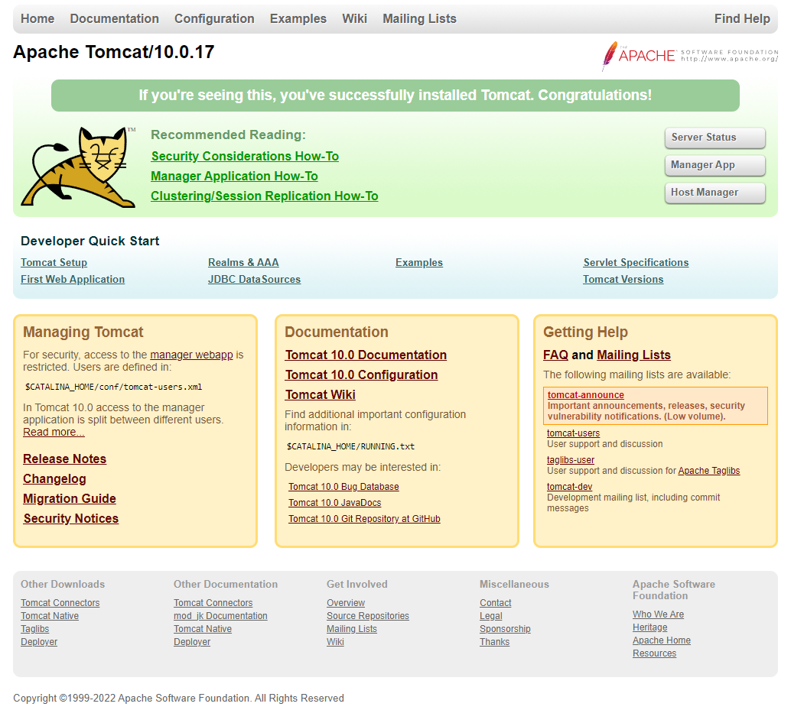

# Instalación de Tomcat.

Es conveniente que desinstalemos de la máquina virtual cualquier otro servidor web que estuviera presente, ya que podría interferir con Tomcat.

Si nginx estuviera instalado, procedemos a su desinstalación.


Para desinstalar Nginx en Ubuntu 20.04, puedes seguir estos pasos:

1. **Detener el servicio de Nginx**: Primero, asegúrate de detener el servicio de Nginx para evitar cualquier interrupción durante el proceso de desinstalación. Puedes detenerlo ejecutando el siguiente comando en tu terminal:

```bash
sudo systemctl stop nginx -y
```

2. **Desinstalar el paquete Nginx**: Una vez que el servicio de Nginx esté detenido, puedes proceder a desinstalar el paquete Nginx. Ejecuta el siguiente comando en la terminal:

```bash
sudo apt-get remove --purge nginx -y
```

Este comando eliminará el paquete Nginx y todos sus archivos de configuración, pero dejará los archivos de datos (como los sitios web) intactos.

3. **Eliminar archivos de configuración residuales**: Si deseas eliminar todos los archivos de configuración residuales de Nginx, puedes ejecutar el siguiente comando:

```bash
sudo apt-get purge nginx-common -y
```

Este comando eliminará cualquier archivo de configuración o datos adicionales relacionados con Nginx.

4. **Limpiar la caché del sistema de paquetes**: Finalmente, puedes limpiar la caché del sistema de paquetes para liberar espacio en disco y eliminar cualquier referencia a Nginx. Ejecuta el siguiente comando:

```bash
sudo apt-get autoremove -y
```

Este comando eliminará cualquier paquete instalado que ya no sea necesario, incluidas las dependencias que se instalaron junto con Nginx.

## Creación de usuario tomcat, instalación de JDK y descarga de Tomcat.

Por razones de seguridad, Tomcat debería ser ejecutado en el contexto de un usuario específico que no tenga privilegios y con el que no podamos iniciar sesión nosotros. Creamos el usuario `tomcat`. Nota: el parámetro `/bin/false` indica a Linux que nadie podrá usar la cuenta `tomcat` para inicar sesión en el sistema.

```bash
sudo useradd -m -d /opt/tomcat -U -s /bin/false tomcat
```

Procedemos a instalar el JDK. El primer lugar actualizamos el repositorio.

```bash
sudo apt update -y
```

Instalamos el JDK.

```bash
sudo apt install default-jdk -y
```

Comprobamos la versión que se ha instalado de JDK de Java.

```bash
java -version
```

Para instalar Tomcat, debemos descargarlo desde su página: https://tomcat.apache.org/download-10.cgi

Cambiamos al directorio `/tmp` para descargarlo y descomprimirlo.

```bash
cd /tmp
```

```bash
wget https://dlcdn.apache.org/tomcat/tomcat-10/v10.1.20/bin/apache-tomcat-10.1.20.tar.gz
```

```bash
sudo tar xzvf apache-tomcat-10*tar.gz -C /opt/tomcat --strip-components=1
```

Asignamos la propiedad de los archivos de Tomcat al usuario `tomcat`

```bash
sudo chown -R tomcat:tomcat /opt/tomcat/
```

Asignamos el permiso de ejecución a todos los archivos de la carpeta `/opt/tomcat/bin`.

```bash
sudo chmod -R u+x /opt/tomcat/bin
```

## Configuración de los usuarios administradores de Tomcat.

Tomcat va a ser gestionado por una página web, como la siguiente:



Concretamente en las páginas `Manager`y `Host Manager` que para poder ser usadas es necesario definir qué usuarios podrán acceder a ellas. Esto se hace en la configuración de Tomcat, concretamente en el archivo `/opt/tomcat/conf/tomcat-users.xml`

Editamos el archivo.

```bash
sudo nano /opt/tomcat/conf/tomcat-users.xml
```

Debemos añadir el siguiente código al final del archivo, justo antes de la etiqueta `/tomcat-users`.

```xml
<role rolename="manager-gui" />
<user username="manager" password="Avante-24,.-" roles="manager-gui" />

<role rolename="admin-gui" />
<user username="admin" password="Avante-24,.-" roles="manager-gui,admin-gui" />
```


[Vamos al siguiente contenido](./10-B.md)