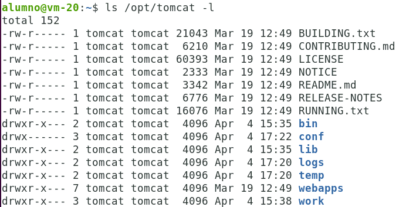
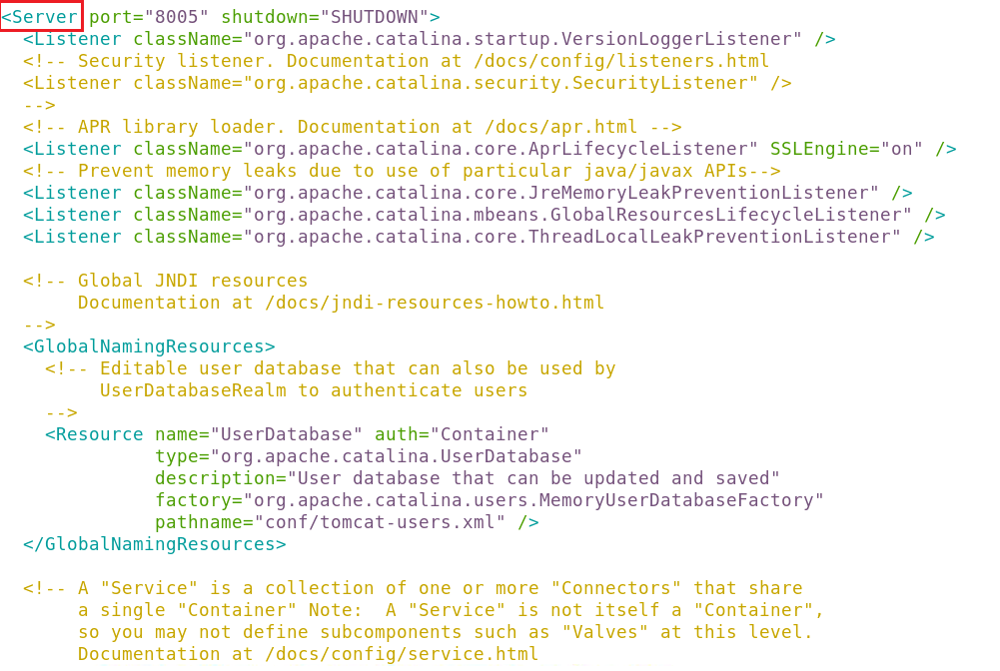

# CConfiguración de Tomcat.

En la instalación estándar de Tomcat 10, podemos encontrar los siguientes directorios importantes:

- `bin`: Contiene los archivos ejecutables de Tomcat, como `startup.sh` (o `startup.bat` en Windows) para iniciar el servidor y `shutdown.sh` (o `shutdown.bat` en Windows) para detenerlo.
  
- `conf`: Contiene archivos de configuración importantes, como `server.xml`, que define la configuración del servidor, y `web.xml`, que define la configuración de los contextos web.

- `lib`: Contiene las bibliotecas de Java que utiliza Tomcat.

- `logs`: Aquí se almacenan los archivos de registro del servidor, como `catalina.out`, que contiene registros de inicio y errores de Tomcat.

- `webapps`: Es el directorio donde se despliegan las aplicaciones web. Al colocar un archivo WAR en este directorio, Tomcat lo desplegará automáticamente.

- `work`: Se utiliza internamente por Tomcat para almacenar archivos temporales relacionados con el despliegue y la ejecución de aplicaciones web.

El archivo `server.xml`, ubicado en el directorio `conf`, contiene la configuración principal del servidor Tomcat. Algunas de las configuraciones que podemos encontrar en este archivo incluyen:

- Definición de conectores HTTP y HTTPS.
- Configuración de los puertos en los que Tomcat escucha las solicitudes.
- Configuración de los directorios base para los archivos de despliegue y de registro.
- Configuración de virtual hosts.

Tomcat proporciona varias opciones de configuración de seguridad para proteger las aplicaciones web y el servidor en sí. Algunas de estas configuraciones incluyen:

- Configuración de acceso mediante autenticación de usuario y contraseña.
- Configuración de listas de acceso basadas en direcciones IP.
- Configuración de conexiones seguras a través de SSL/TLS.

Tomcat permite la configuración de diversos recursos que pueden ser utilizados por las aplicaciones web, como bases de datos, colas de mensajes, etc. Algunos ejemplos de recursos configurables incluyen:

- Conexiones a bases de datos (DataSource).
- Recursos JNDI para almacenar y recuperar objetos Java. JNDI (Java Naming and Directory Interface) es una API que permite a las aplicaciones Java buscar y obtener recursos de manera dinámica durante la ejecución sin depender de la ubicación o configuración específica de estos recursos.

Tomcat utiliza el sistema de logging de Java (`java.util.logging`) por defecto, pero también es compatible con otros sistemas de logging como `Log4j`. Podemos configurar el nivel de detalle de los registros y la salida de los registros en el archivo `logging.properties` ubicado en el directorio `conf`.

Los tipos de elementos (etiquetas) que podemos encontrarnos en `server.xml` son:

1. `Server`: Es el elemento superior en el archivo `server.xml`. Define un único servidor Tomcat. Generalmente. Un elemento Server puede contener elementos del tipo `Logger` y `ContextManager`.

    En la imagen podemos ver el inicio del elemento `server` en el archivo de configuración.

    

2. `Logger`: Cada logger tiene un nombre para identificarlo, así como una ruta al archivo de registro para contener la salida del logger y un nivel de verbosidad (que especifica el nivel de registro). Actualmente hay loggers para los servlets (donde va el ServletContext.log()), archivos JSP y el tiempo de ejecución de Tomcat.

ContextManager: Un ContextManager especifica la configuración y estructura para un conjunto de ContextInterceptors, RequestInterceptors, Contexts y sus Connectors. El ContextManager tiene algunos atributos que le proporcionan:
- Nivel de depuración utilizado para registrar mensajes de depuración.
- La ubicación base para webapps/, conf/, logs/ y todos los contextos definidos. Se utiliza para iniciar Tomcat desde un directorio que no sea TOMCAT_HOME.
- El nombre del directorio de trabajo.
- Una bandera para controlar si se incluyen trazas de pila y otra información de depuración en las respuestas predeterminadas.

ContextInterceptor & RequestInterceptor: Estos interceptores escuchan ciertos eventos que ocurren en el ContextManager. Por ejemplo, el ContextInterceptor escucha los eventos de inicio y apagado de Tomcat, y el RequestInterceptor observa las diversas fases que las solicitudes de usuario necesitan pasar durante su servicio. El administrador de Tomcat no necesita saber mucho sobre los interceptores; un desarrollador, por otro lado, debería saber que así es como se pueden implementar operaciones tipo "globales" en Tomcat (por ejemplo, seguridad y registro por solicitud).

Connector: El Connector representa una conexión con el usuario, ya sea a través de un servidor web o directamente al navegador del usuario (en una configuración independiente). El objeto connector es el responsable de la gestión de los hilos de trabajo de Tomcat y de la lectura/escritura de solicitudes/respuestas desde los sockets que se conectan a los diversos clientes. La configuración de los conectores incluye información como:
- La clase del manejador.
- El puerto TCP/IP donde escucha el manejador.
- La cola de espera TCP/IP para el socket del servidor del manejador.
Describiremos cómo utilizar esta configuración de Connector más adelante en el documento.

Contexto: Cada Contexto representa una ruta en la jerarquía de Tomcat donde colocas una aplicación web. Un Contexto de Tomcat tiene la siguiente configuración:
- La ruta donde se encuentra el contexto. Esto puede ser una ruta completa o relativa al directorio principal del ContextManager.
- Nivel de depuración utilizado para registrar mensajes de depuración.
- Una bandera de recarga. Al desarrollar un servlet, es muy conveniente que Tomcat lo recargue al cambiarlo, esto te permite corregir errores y hacer que Tomcat pruebe el nuevo código sin necesidad de apagar y reiniciar. Para activar la recarga de servlets, establece la bandera de recarga en true. Sin embargo, detectar cambios consume tiempo; además, como los nuevos servlets se están cargando en un nuevo objeto de cargador de clases, hay casos donde este disparador de recarga de clases genera errores. Para evitar estos problemas, puedes establecer la bandera de recarga en false; esto desactivará la función de recarga automática.

[text](https://tomcat.apache.org/tomcat-10.1-doc/config/)

[Vamos al siguiente contenido](./10-D.md)